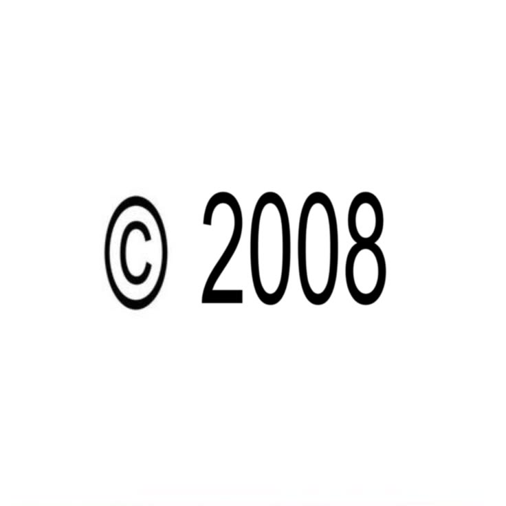
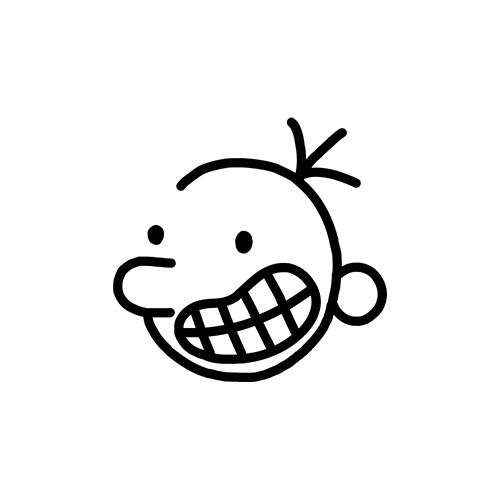
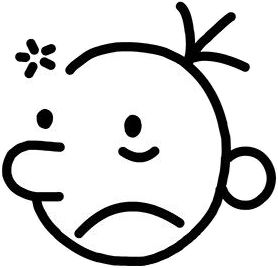

  

<h1 align="center">Hi, I'm Sarah 👋</h1>

  <code><strong>she/her</strong></code> • <em>A programming student who wants to graduate in neuroscience someday and sleep issue :D</em>

---

<table border="0" cellpadding="0" cellspacing="0">
  <tr>
    <td width="500px" valign="middle">
      <h2>🌸 About Me</h2>
      
I'm a final-year high school student studying programming, with experience in <strong>HTML/CSS, SQL, Python and C#</strong>.

      
When I'm not at school, I usually spend my free time tinkering with electronics, reading, playing video games, or inventing new ways to grow in the world of programming and technology!

      <h3>🎯 Special Interests</h3>
      <ul>
        <li>🧠 <strong>Neuroscience</strong></li>
        <li>♿ <strong>Accessibility Technology</strong></li>
        <li>🤖 <strong>Robotics</strong></li>
        <li>💻 <strong>Programming</strong></li>
        <li>🎮 <strong>Gaming</strong></li>
      </ul>
      
<em>Feel free to browse my work!</em>

    </td>
    <td width="40px"></td>
    <td width="160px" align="right" valign="middle">
      
    </td>
  </tr>
</table>

---

## 🧩 Current Project

### **Painel das Emoções**
> A technology-assisted project designed to help children with autism communicate emotions in a simple, visual and accessible way.
> 
> This project combines programming, accessibility and educational support to create a more inclusive experience for children who benefit from visual communication tools.

---

<table border="0" cellpadding="0" cellspacing="0">
  <tr>
    <td width="500px" valign="middle">
      <h2>🛠 Skills</h2>
      <h3>💻 Technologies & Languages</h3>
      

        
        
        
        
        
      

      <h3>⚙️ Other Fields</h3>
      <ul>
        <li>🗄️ Databases & Data Structure</li>
        <li>🤖 Robotics & Hardware Tinkering</li>
      </ul>
    </td>
    <td width="40px"></td>
    <td width="160px" align="right" valign="middle">
      
    </td>
  </tr>
</table>

---

## 📊 GitHub Stats

  

---

## ✨ Interests & Hobbies
* 💻 Programming & Electronics
* 🧠 Neuroscience & Accessibility
* 🤖 Robotics
* 📚 Reading & 🎮 Video Games

---

## 💭 Favorite Quote
<blockquote>
  
<em>"Technology becomes meaningful when it helps people."</em>

</blockquote>

---

⭐ Thanks for visiting my profile! ⭐

